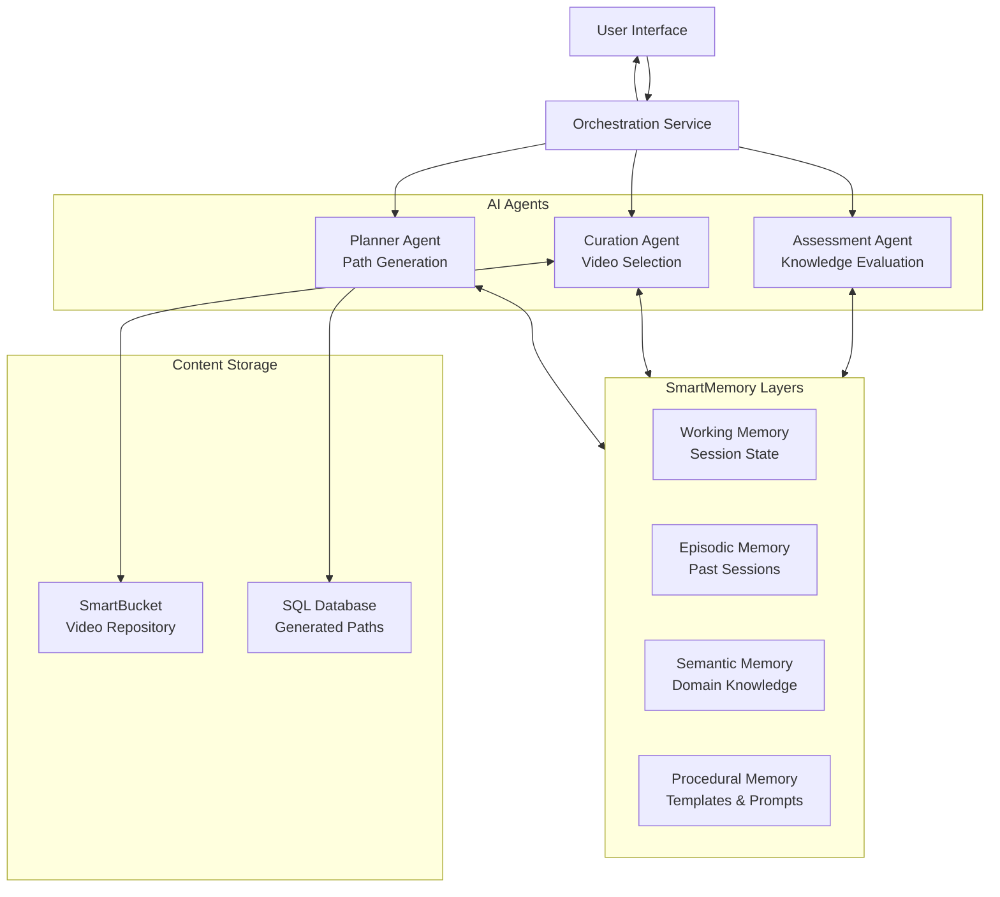
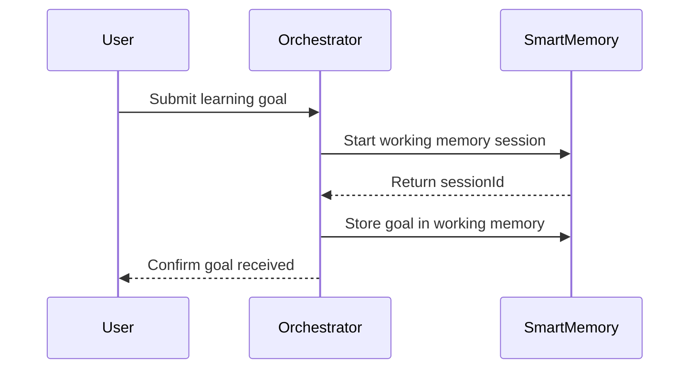
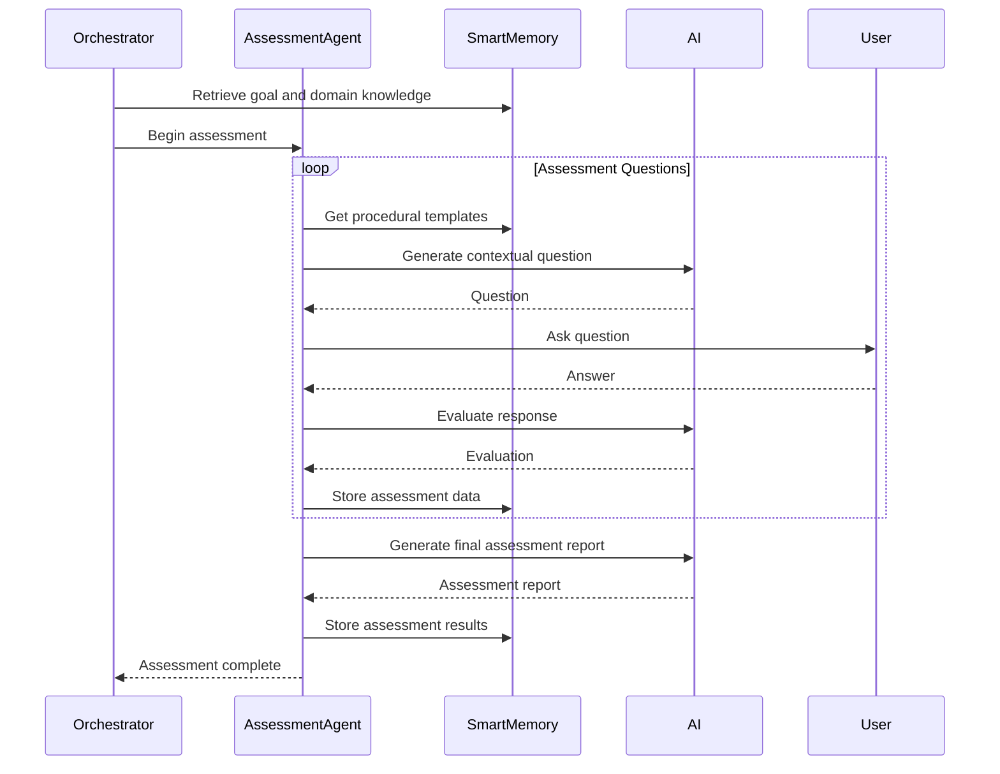
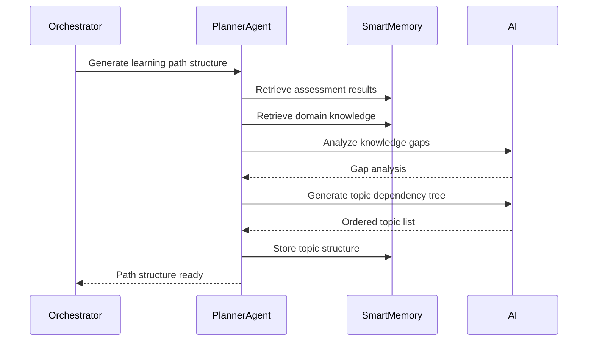
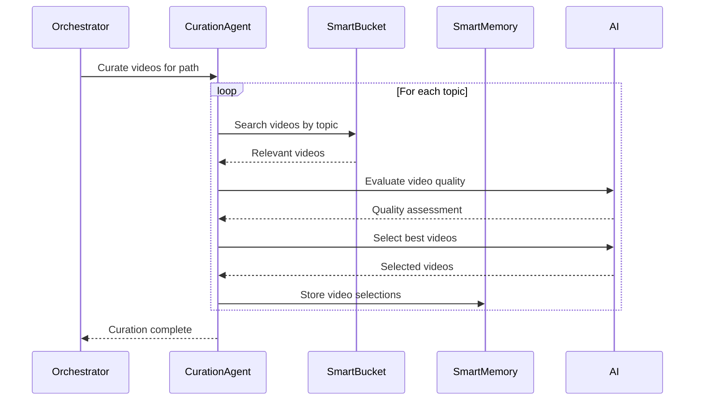
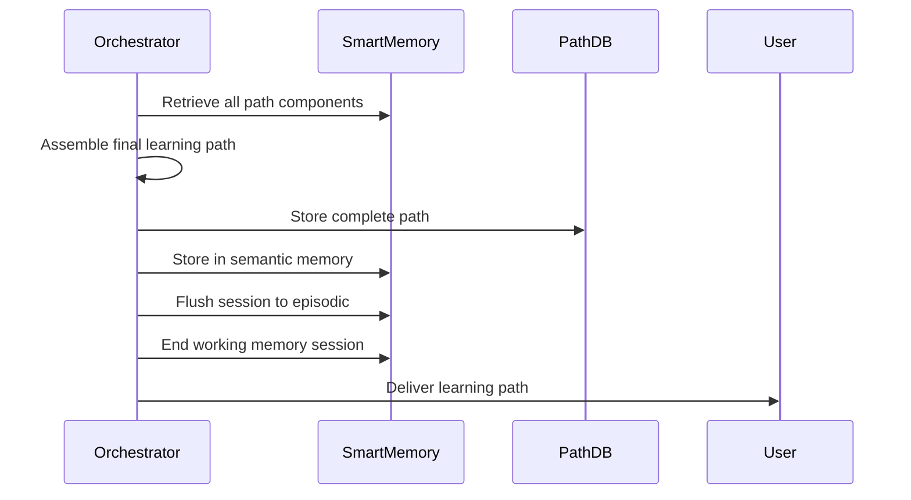

# Learning Path Agent - Architecture Design

## Overview

The Learning Path Agent is an intelligent system that creates personalized learning courses from curated YouTube videos using the Raindrop MCP platform. The system assesses user knowledge, identifies gaps, and constructs structured learning paths with appropriate video resources.

## System Architecture

### High-Level Architecture



## Core Components

### 1. Orchestration Service
**Purpose:** Main entry point that coordinates the entire learning path generation workflow

**Responsibilities:**
- Receive user learning goals
- Manage workflow state transitions
- Coordinate agent interactions
- Handle session lifecycle
- Return final learning paths

**Technology:** Raindrop Service component

### 2. Assessment Agent
**Purpose:** Evaluate user's current knowledge level and identify gaps

**Responsibilities:**
- Generate contextual assessment questions
- Analyze user responses
- Determine knowledge level for topics
- Identify prerequisite gaps
- Produce knowledge assessment report

**Components:**
- Service: Question generation and response analysis
- AI Model: 70b+ for intelligent questioning and evaluation
- SmartMemory: Access to procedural templates and semantic knowledge

### 3. Curation Agent
**Purpose:** Search and select appropriate YouTube videos for learning topics

**Responsibilities:**
- Search video repository by topic
- Evaluate video quality and relevance
- Assess difficulty and prerequisites
- Select optimal video sequences
- Order videos for progressive learning

**Components:**
- Service: Video search and selection logic
- AI Model: Content evaluation and quality assessment
- SmartBucket: Video metadata repository with semantic search

### 4. Planner Agent
**Purpose:** Generate structured learning paths from assessment and curated content

**Responsibilities:**
- Create topic dependency tree
- Order topics logically (prerequisites first)
- Structure learning modules
- Generate explanations for topic ordering
- Produce final learning path document

**Components:**
- Service: Path structuring and generation
- AI Model: Logic and explanation generation
- SmartMemory: Store generated paths

## Data Architecture

### SmartBucket: Video Repository

**Structure:**
```json
{
  "videoId": "dQw4w9WgXcQ",
  "title": "Introduction to Deployment Concepts",
  "channel": "Tech Education",
  "url": "https://youtube.com/watch?v=...",
  "duration": "15:30",
  "description": "Learn the basics of deploying applications...",
  "transcript": "Full video transcript for semantic search...",
  "topics": ["deployment", "CI/CD", "hosting"],
  "difficulty": "beginner",
  "prerequisites": [],
  "tags": ["deployment", "basics", "tutorial"]
}
```

**Usage:**
- Semantic search by topic
- Filter by difficulty level
- Query by prerequisites
- Document chat for detailed analysis

### SmartMemory Layers

#### Working Memory (Session State)
Stores active session data during learning path generation:

```typescript
{
  sessionId: "session-uuid",
  timeline: "main",
  entries: [
    {
      content: "User goal: Learn Vercel deployment",
      key: "user_goal",
      agent: "orchestrator"
    },
    {
      content: "Assessment: User knows React but not deployment",
      key: "assessment_result",
      agent: "assessment_agent"
    },
    {
      content: "Topics: [deployment basics, Vercel specifics]",
      key: "topic_tree",
      agent: "planner_agent"
    }
  ]
}
```

#### Episodic Memory (Historical Sessions)
Stores summaries of completed learning path generations:

```typescript
{
  sessionId: "session-uuid",
  summary: "Generated deployment learning path for React developer",
  metadata: {
    goal: "Learn Vercel",
    knowledgeLevel: "intermediate-frontend",
    topicsCount: 5,
    videosCount: 12
  },
  createdAt: "2025-10-28T..."
}
```

#### Semantic Memory (Domain Knowledge)
Stores structured knowledge about topics and relationships:

```json
{
  "topic": "Vercel",
  "category": "deployment-platform",
  "prerequisites": [
    "frontend-basics",
    "git-basics",
    "deployment-concepts"
  ],
  "subtopics": [
    "vercel-cli",
    "vercel-config",
    "edge-functions",
    "deployment-workflows"
  ],
  "relatedTopics": ["Netlify", "AWS Amplify"],
  "difficultyLevel": "intermediate"
}
```

#### Procedural Memory (Templates & Prompts)
Stores reusable templates and agent system prompts:

```typescript
// Assessment question template
{
  key: "assessment_template",
  value: `Generate 3-5 questions to assess knowledge of {topic}.
          Questions should evaluate: {criteria}.
          Adapt difficulty based on: {context}.`
}

// Curation criteria
{
  key: "video_curation_criteria",
  value: `Select videos that:
          1. Match the topic focus
          2. Are appropriate for {difficulty_level}
          3. Have clear explanations
          4. Include practical examples
          5. Are recent (prefer <2 years old)`
}
```

### SQL Database: Generated Paths

Stores complete learning paths for future reference and analytics:

```sql
CREATE TABLE learning_paths (
  id TEXT PRIMARY KEY,
  user_id TEXT,
  goal TEXT,
  knowledge_level TEXT,
  created_at TIMESTAMP,
  path_data JSON -- Complete structured learning path
);

CREATE TABLE path_modules (
  id TEXT PRIMARY KEY,
  path_id TEXT,
  module_order INTEGER,
  topic TEXT,
  explanation TEXT,
  FOREIGN KEY (path_id) REFERENCES learning_paths(id)
);

CREATE TABLE module_videos (
  id TEXT PRIMARY KEY,
  module_id TEXT,
  video_id TEXT,
  video_order INTEGER,
  video_data JSON,
  FOREIGN KEY (module_id) REFERENCES path_modules(id)
);
```

## Workflow Design

### Phase 1: Goal Collection



**Implementation:**
```typescript
async handleGoalSubmission(goal: string) {
  // Start new session
  const { sessionId, workingMemory } =
    await this.env.AGENT_MEMORY.startWorkingMemorySession();

  // Store goal
  await workingMemory.putMemory({
    content: `User learning goal: ${goal}`,
    key: "user_goal",
    agent: "orchestrator"
  });

  return { sessionId };
}
```

### Phase 2: Knowledge Assessment



**Implementation:**
```typescript
async conductAssessment(sessionId: string, goal: string) {
  const workingMemory = await this.env.AGENT_MEMORY
    .getWorkingMemorySession(sessionId);

  // Get prerequisite knowledge for topic
  const prerequisites = await this.getPrerequisites(goal);

  // Generate and ask questions iteratively
  const assessmentResults = [];
  for (const prereq of prerequisites) {
    const question = await this.generateQuestion(prereq);
    const answer = await this.askUser(question);
    const evaluation = await this.evaluateAnswer(prereq, answer);

    assessmentResults.push({ prereq, evaluation });

    await workingMemory.putMemory({
      content: `${prereq}: ${evaluation.level}`,
      key: "assessment",
      agent: "assessment_agent"
    });
  }

  return assessmentResults;
}
```

### Phase 3: Gap Analysis & Path Planning



**Implementation:**
```typescript
async generatePathStructure(sessionId: string) {
  const workingMemory = await this.env.AGENT_MEMORY
    .getWorkingMemorySession(sessionId);

  // Retrieve assessment data
  const assessments = await workingMemory.getMemory({
    key: "assessment"
  });

  // Get goal
  const goalMemory = await workingMemory.getMemory({
    key: "user_goal"
  });

  // Retrieve domain knowledge about topic
  const domainKnowledge = await this.env.AGENT_MEMORY
    .searchSemanticMemory(goalMemory[0].content);

  // Generate topic tree
  const topicTree = await this.env.AI_MODEL.generateText({
    systemPrompt: "You are an educational path planner...",
    prompt: `
      Goal: ${goalMemory[0].content}
      Current Knowledge: ${JSON.stringify(assessments)}
      Domain Info: ${JSON.stringify(domainKnowledge)}

      Generate an ordered list of topics to learn, with:
      1. Logical prerequisite ordering
      2. Explanation of why each topic is needed
      3. Estimated difficulty level
    `
  });

  await workingMemory.putMemory({
    content: JSON.stringify(topicTree),
    key: "topic_tree",
    agent: "planner_agent"
  });

  return topicTree;
}
```

### Phase 4: Video Curation



**Implementation:**
```typescript
async curateVideos(sessionId: string, topics: Topic[]) {
  const workingMemory = await this.env.AGENT_MEMORY
    .getWorkingMemorySession(sessionId);

  const curatedPath = [];

  for (const topic of topics) {
    // Search for videos
    const searchResults = await this.env.VIDEO_BUCKET.search({
      input: topic.name,
      requestId: `${sessionId}-${topic.id}`
    });

    // Evaluate and select videos
    const selectedVideos = await this.selectBestVideos(
      searchResults.results,
      topic.difficulty,
      topic.criteria
    );

    curatedPath.push({
      topic: topic.name,
      explanation: topic.explanation,
      videos: selectedVideos
    });

    await workingMemory.putMemory({
      content: JSON.stringify({ topic: topic.name, videos: selectedVideos }),
      key: "curated_videos",
      agent: "curation_agent"
    });
  }

  return curatedPath;
}
```

### Phase 5: Finalization & Delivery



**Implementation:**
```typescript
async finalizeLearningPath(sessionId: string) {
  const workingMemory = await this.env.AGENT_MEMORY
    .getWorkingMemorySession(sessionId);

  // Gather all components
  const goal = await workingMemory.getMemory({ key: "user_goal" });
  const assessment = await workingMemory.getMemory({ key: "assessment" });
  const topicTree = await workingMemory.getMemory({ key: "topic_tree" });
  const videos = await workingMemory.getMemory({ key: "curated_videos" });

  // Assemble final path
  const learningPath = {
    goal: goal[0].content,
    knowledgeLevel: this.assessmentToLevel(assessment),
    modules: this.assemblePath(topicTree, videos),
    createdAt: new Date()
  };

  // Store in database
  await this.env.PATH_DB.insert("learning_paths", learningPath);

  // Store in semantic memory for future reference
  await this.env.AGENT_MEMORY.putSemanticMemory(learningPath);

  // End session and flush to episodic
  await workingMemory.endSession(true);

  return learningPath;
}
```

## API Design

### REST Endpoints

#### POST /api/learning-path/start
Start a new learning path generation

**Request:**
```json
{
  "goal": "I want to learn Vercel deployment"
}
```

**Response:**
```json
{
  "sessionId": "session-uuid",
  "status": "assessment_pending",
  "message": "Let's assess your current knowledge"
}
```

#### POST /api/learning-path/answer
Submit answer to assessment question

**Request:**
```json
{
  "sessionId": "session-uuid",
  "questionId": "q-1",
  "answer": "I have experience with React and Next.js"
}
```

**Response:**
```json
{
  "nextQuestion": {
    "id": "q-2",
    "question": "Are you familiar with Git and version control?"
  },
  "progress": {
    "current": 2,
    "total": 5
  }
}
```

#### GET /api/learning-path/{sessionId}
Retrieve completed learning path

**Response:**
```json
{
  "goal": "Learn Vercel deployment",
  "knowledgeLevel": "intermediate-frontend",
  "modules": [
    {
      "order": 1,
      "topic": "Deployment Fundamentals",
      "explanation": "Understanding core deployment concepts before Vercel-specific features",
      "videos": [
        {
          "videoId": "abc123",
          "title": "What is Deployment?",
          "url": "https://youtube.com/watch?v=abc123",
          "duration": "10:30",
          "channel": "Tech Basics"
        }
      ]
    },
    {
      "order": 2,
      "topic": "Vercel Platform Basics",
      "explanation": "Introduction to Vercel platform and its features",
      "videos": [...]
    }
  ]
}
```

## Raindrop Manifest

```hcl
application "learning-path-agent" {

  # Main orchestration service
  service "orchestrator" {
    port = 8080
  }

  # Specialized agent services
  service "assessment-agent" {}
  service "curation-agent" {}
  service "planner-agent" {}

  # AI models for reasoning
  ai "reasoning-engine" {
    # 70b+ model for complex reasoning
  }

  # Multi-layered memory system
  smartmemory "agent-memory" {}

  # Video repository with semantic search
  smartbucket "video-repository" {}

  # Persistent storage for generated paths
  sql_database "path-database" {}

  # Optional: Queue for async processing
  queue "processing-queue" {}
}
```

## Technology Stack

### Core Framework
- **Raindrop Framework** - Primary application platform
- **TypeScript** - Type-safe development
- **Raindrop Services** - HTTP API endpoints
- **Raindrop AI** - Large language models

### Storage & Memory
- **SmartMemory** - Session and knowledge management
- **SmartBucket** - Video metadata and semantic search
- **SmartSQL** - Relational data storage

### Frontend (Optional)
- **Next.js** - React-based web interface
- **Tailwind CSS** - Styling
- **shadcn/ui** - UI components

### External Integrations
- **YouTube Data API** - Video metadata retrieval
- **YouTube Transcript API** - Video transcripts for indexing

## Implementation Roadmap

### Phase 1: Foundation (Week 1-2)
1. Set up Raindrop project structure
2. Define manifest with all components
3. Create basic orchestration service
4. Initialize SmartMemory with procedural templates
5. Set up SmartBucket for video storage

### Phase 2: Assessment System (Week 3-4)
1. Implement assessment agent service
2. Create question generation logic
3. Build response evaluation system
4. Integrate with SmartMemory
5. Test assessment flows

### Phase 3: Path Planning (Week 5-6)
1. Implement planner agent service
2. Create topic dependency analyzer
3. Build prerequisite mapping system
4. Integrate with semantic memory
5. Test path generation

### Phase 4: Video Curation (Week 7-8)
1. Implement curation agent service
2. Populate video repository
3. Build semantic search queries
4. Create quality evaluation system
5. Test video selection

### Phase 5: Integration & Polish (Week 9-10)
1. End-to-end workflow integration
2. API endpoint implementation
3. Error handling and validation
4. Performance optimization
5. Testing and debugging

### Phase 6: Frontend (Week 11-12)
1. Build user interface
2. Implement interactive assessment
3. Create learning path visualization
4. Add progress tracking
5. Deploy and test

## Best Practices

### Memory Management
- Use working memory for active sessions only
- Flush to episodic memory after completion
- Store reusable patterns in procedural memory
- Index knowledge relationships in semantic memory

### Video Curation
- Prefer recent videos (<2 years old)
- Verify video availability before adding
- Include channel credibility in evaluation
- Consider video length for pacing

### Assessment Design
- Start with broad questions, narrow down
- Adapt difficulty based on responses
- Ask 3-5 questions per topic area
- Allow users to skip if uncertain

### Path Structure
- Always order by prerequisites
- Provide clear explanations for ordering
- Group related topics into modules
- Balance breadth and depth

### Performance
- Cache frequently accessed semantic memory
- Use async operations for agent coordination
- Batch video searches when possible
- Implement request pagination

## Future Enhancements

1. **Progress Tracking** - Allow users to mark videos as completed
2. **Adaptive Paths** - Adjust path based on user feedback
3. **Community Ratings** - Collect feedback on video quality
4. **Multi-Language** - Support videos in multiple languages
5. **Skill Trees** - Visual representation of learning paths
6. **Collaborative Learning** - Share and fork learning paths
7. **Integration with LMS** - Export to learning management systems
8. **Mobile App** - Native mobile experience
